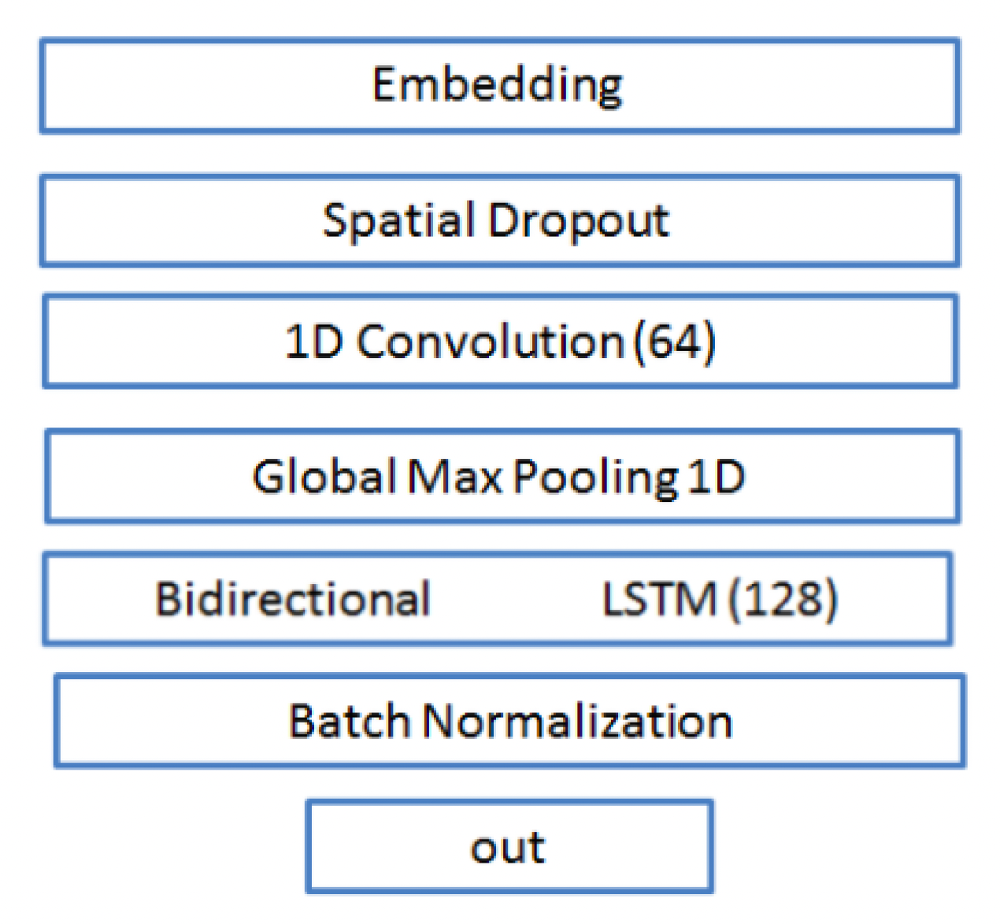
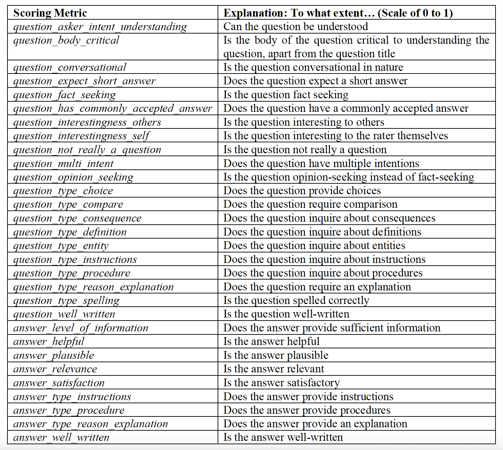

<h1> Google Research competition: Scoring Q&A algorithms Built LSTM with 0.401 binary cross-entropy loss</h1>
I competed in the Question-Answering Labelling Competition, and emerged top 15% out of 1571 participants.
 
<li> Deep learning using Keras, PyTorch
<li>Multi-target task: Predict 30 targets using 1 model
<li>Text embeddings extraction using GloVE, BERT
 
# About
Question-answering is a discipline within the field of natural language processing that is concerned with building systems that automatically answer questions posed by humans in a natural language.

This project builds a deep learning model that predicts the quality of automated answers to human-posed questions, taking only text features of the question title, question body, and answer.

# Methodology
## 1. Preprocess text features
<li>Convert all text to lowercase
<li>Separate joined words commonly used in speech. For instance, “I’m” is separated into “I am”
<li>Remove punctuation
<li>Remove stop words

## 2. Create numeric representations for text features
One of the main design decisions when building a deep learning model with text data is the question of whether to utilize pre-trained word embeddings or to construct an embedding layer within the model to be trained from scratch with respect to the problem at hand. Since the dataset available for this task is relatively small with 10,000 rows, I choose to employ the transfer learning method instead of training my own. I explore 2 state-of-the-art pre-trained algorithms for this: GloVe and BERT.

### 2.1. GloVE (Global Vectors for Word Representation)
GloVE is a pre-trained word embedding algorithm trained on Wikipedia and Gigaword data. The advantage of GloVe lies in its utilization of both local statistics (local context information of words) and global statistics (word co-occurrence) to obtain word embeddings.

I first tokenize and pad all text using Keras’ Tokenizer class. Within the subsequent model architecture, I replace the parameters of the embedding layer with these pre-trained embeddings and freeze the layer, preventing its weights from being updated during model training. Importantly, since the test set must remain unseen to avoid introducing bias, I utilize the same tokenizer trained on the training set in order to tokenize words in the test set. This implies that words found only in the test set and not the training set cannot be embedded, and have their embeddings set to 0. I also pad to the same length and specifications as the training set.

### 2.2. BERT (Bidirectional Encoder Representations from Transformer)
BERT is a pre-trained language model created at Google that applies the bidirectional training of transformers to language modelling, allowing for a deeper sense of language context. Traditional single-direction language models produce a fixed representation for a word regardless of the context within which the word appears. In contrast, BERT’s representations for words are dynamically informed by the words around them.

I follow a strategy proposed by BERT’s original creators: I first pass the dataset’s text data into the pre-trained BERT model and obtain the weights on its last 4 hidden layers. The summation of these weights is then used as input features for the subsequent deep learning model. These were conducted using PyTorch with the Hugging Face library.

## 3. Model architecture: LSTM with Convolutional layers
There exists many different model architectures possible for this prediction task. In order to determine the optimal architecture, I took inspiration from the winners of similar competitions on Kaggle. In particular, I experiment with the model architecture used by the winner of a recent NLP competition held by Quora:

## 4. Model tuning: Increase model regularization
<li>Increase traditional dropout
<li>Add recurrent dropout to LSTM layer in order for recurrent weights to be additionally regularized

## 5. Model tuning: Increase model complexity
<li>Increase number of convolutional layers
<li>Increase number of LSTM layers
<li>Tune learning rate used under the Adam optimizer

# One cool takeaway: Selecting optimal loss function under multi-target task
For each question-answer pair, the 30 targets to be predicted are the quality of the question and answer along 30 different metrics, as follows:

At first glance, since the 30 targets are each scored between 0 and 1, the immediate impression is that all 30 targets are continuous. However, investigating the targets using a boxplot reveals the following:

10 of these targets take on less than 10 unique values each. This indicates that these 10 targets should instead be regarded as categorical instead of continuous, contrary to the initial impression that all 30 targets are continuous.

In light of this, I implement the binary cross-entropy loss for my model, due to:
<li>As mentioned, 10 of the 30 targets should instead be regarded as categorical instead of continuous. This lends strength towards utilizing binary cross-entropy loss instead of regression-based losses.
<li>More importantly though, all the targets have a value of between 0 and 1. As such, they can be treated akin to probabilities under categorical target prediction. The usage of binary cross-entropy loss ensures that predictions for these target values remain between the range of 0 and 1, as compared to using traditional regression-based losses which will not.

# Still curious?
I authored a research paper covering the details of my methodology and findings when I took a PhD-level Deep Learning class at Columbia.

You can find my paper <a href="https://github.com/sheilateozy/Google_Scoring-QA-Algorithms/blob/main/research_paper/research_paper.pdf">here</a> :) 

